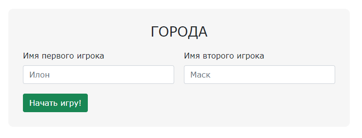
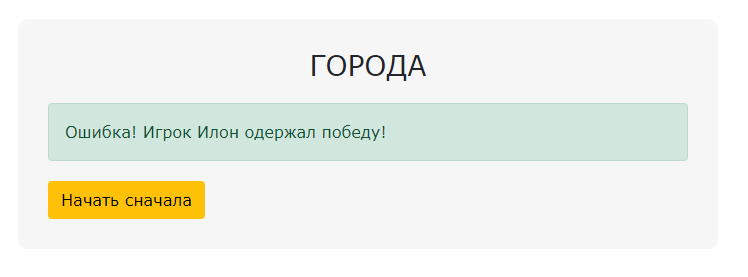

### Задание

В уроке **4. Functional Programming. OOP** мы реализовали простую игру в "Города" на
классах. Настало время перенести нашу игру в веб.

В данной задаче необходимо доработать функцию `setCitiesGame`, отвечающую за логику игры "
Города"

### Исходные данные

Базовый `DOM` имеет следующую структуру

```
<div class="main cities">
    <h3>ГОРОДА</h3>

    <div class="cities__main-block cities__start-block active">
        <div class="cities__names-container">
            <div class="cities__block">
                <label for="name-first" class="form-label">
                    Имя первого игрока
                </label>
                <input type="email" class="form-control" id="name-first" placeholder="Илон">
            </div>
            <div class="cities__block cities__block--second">
                <label for="name-second" class="form-label">
                    Имя второго игрока
                </label>
                <input type="email" class="form-control" id="name-second" placeholder="Маск">
            </div>
        </div>
        <button type="button" class="cities__button cities__button--start btn btn-success">
            Начать игру!
        </button>
    </div>

    <div class="cities__main-block cities__game-block">
        <label for="new-city" class="form-label">
            Введите название города
        </label>
        <input type="email" class="form-control" id="new-city" placeholder="Казань">
        <button type="button" class="cities__button cities__button--add btn btn-primary">
            Добавить
        </button>
        <div class="cities__names-container">
            <div class="cities__user-name cities__user-name--first active"></div>
            <div class="cities__user-name cities__user-name--second"></div>
        </div>
        <div class="cities__cities-container ">
            <div class="cities__user-cities cities__user-cities--first"></div>
            <div class="cities__user-cities cities__user-cities--second"></div>
        </div>
    </div>

    <div class="cities__main-block cities__finish-block">
        <div class="alert alert-success" role="alert"></div>
        <button type="button" class="cities__button cities__button--restart btn btn-warning">
            Начать сначала
        </button>
    </div>
</div>
```

В самой функции уже выделено состояние и реализована часть методов

### Логика игры

1. Имеет три блока для отображения - стартовый (`start`), игровой (`game`) и
   финишный (`finish`).

Первый блок - стартовый (`start`). Здесь необходимо добавить имена игроков и нажать
кнопку "Начать игру!"


Далее открывается второй блок - `game`. Здесь игроки по очереди добавляют города (первая
буква города должна совпадать с последней буквой последнего слова противника) до тех пор,
пока кто-либо не ошибется. <br>


При добавлении нового города поле ввода очищается, активный (выделенный) игрок меняется на
его соперника. Города каждого участника записываются под его именем


После чьей-то ошибки открывается третий блок - финишный (`finish`). Здесь появляется
сообщение о том, что один из игроков одержал победу, а также кнопка "Начать сначала".



### Задачи

Функция должна работать следующим образом:

1. При переключении между блоками только один их них активен (другие скрыты). Видимость
   настраивается с помощью "навешивания" класса `active` на нужный блок(по умолчанию это
   элемент `.cities__start-block`). Если класса нет, блок не отображается
2. Для смены "активности" игроков также служит класс `active` (зеленый фон и обводка). По
   умолчанию "активным" игроком является первый (элемент `.cities__user-name--first`)
3. В момент нажатия на кнопку "Добавить" происходит проверка на корректность данного
   названия (первая буква должна быть аналогичной последней букве в последнем городе
   соперника). После чего либо происходит переход в блок `finish`, либо город добавляется
   в блок пользователя. Добавление происходит в виде элемента `span` с текстом города в
   один из блоков `.cities__user-cities`. Поле ввода очищается
4. Когда один из участников ошибается должен отобразиться третий блок (финишный). Где
   будет уведомление `Ошибка! Игрок ${winner} одержал победу!` (необходимо поместить текст
   в элемент `.alert alert-success`). Здесь же присутствует кнопка "Начать сначала", при
   нажатии на которую снова отображается первый блок, все поля ввода очищаются, игроки и
   города сбрасываются. Далее игра начинается сначала.

### Где посмотреть

1. Для визуального отслеживания изменений необходимо открыть в браузере
   файл `./src/index.html`

### Условия выполнения

1. Все манипуляции выполняются с помощью методов нативного `js`;
2. В функции выделено общее состояние. Данные для отображения берутся только оттуда;
3. Решение реализовано через концепцию `MVC`.

### Подсказки

1. Внимательно изучите дефолтное `DOM`-дерево и уже проработанные методы, а также
   состояние приложения
